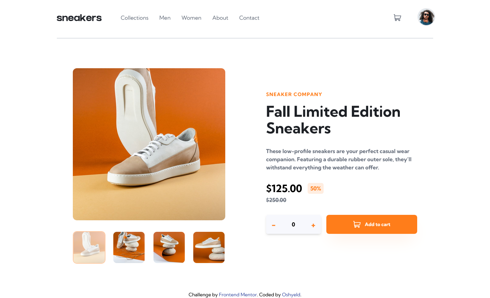

# Frontend Mentor - E-commerce product page solution

This is a solution to the [E-commerce product page challenge on Frontend Mentor](https://www.frontendmentor.io/challenges/ecommerce-product-page-UPsZ9MJp6).

## Table of contents

- [Overview](#overview)
  - [The challenge](#the-challenge)
  - [Screenshot](#screenshot)
  - [Links](#links)
- [My process](#my-process)
  - [Built with](#built-with)
  - [What I learned](#what-i-learned)
  - [Continued development](#continued-development)
  - [Useful resources](#useful-resources)
- [Author](#author)
- [Acknowledgments](#acknowledgments)

## Overview

### The challenge

Users should be able to:

- View the optimal layout for the site depending on their device's screen size
- See hover states for all interactive elements on the page
- Open a lightbox gallery by clicking on the large product image
- Switch the large product image by clicking on the small thumbnail images
- Add items to the cart
- View the cart and remove items from it

Added by myself :

- Show a toast when users add a product to the cart
- Show a confetti explosion when the user checks out
- Disable "Add to cart button" when there's 0 product to add
- Made a responsive view for tablet devices.

### Screenshot



### Links

- Solution URL: [Add solution URL here](https://your-solution-url.com)
- Live Site URL: [E-commerce Product Page](https://dinadess.github.io/e-commerce-fm/)

## My process

### Built with

- Semantic HTML5 markup
- Flexbox
- CSS Grid
- [React](https://react.dev/) - JS library
- [Tailwind CSS](https://tailwindcss.com/) - CSS framework
- [React Confetti Explosion](https://alampros.github.io/react-confetti/) - A react package to add a confetti animation to a website
- [React Toastify](https://fkhadra.github.io/react-toastify/) - React Toast library to display toasts tu users (I later on found another toast library : [React Hot Toast](https://react-hot-toast.com/))

### What I learned

It was my first time building a whole project with React on my own so I learned a lot through trial and error.

1- My primary pain point was about how to attach a function to a button.

Instead of attaching the event listener to the button like in the first snippet, I directly called the function which resulted in errors as it would get called indefinitely.

GOOD 👍

```js
<button onClick={() => setShowCart((s) => !s)}>Cart</button>
```

BAD 👎

```js
<button onClick={setShowCart((s) => !s)}>Cart</button>
```

_Notice the absence of parenthesis in the second snippet._

2- While building the gallery, I initially tried using the GSAP animation library (with FLIP) to add some cool animations when the user clicks on the main product image. But then, I realised it was too much of a hassle to handle and that I didn't have enough understanding of GSAP for that and finally that it was maybe not doable. So I backed off.
I then tried using JS animation galleries ([Lightgallery](https://www.lightgalleryjs.com/) and [Fancyapps' Fancybox and Carousel](https://fancyapps.com/fancybox/)) to no avail. And I finally realized that I didn't need any of those tools. So I just built the gallery by myself and in the process I found out it was part of the project to built the gallery :)

### Continued development

As I'm just at the beginning of my React journey, I'll keep learning and improving through projects.

### Useful resources

- [Deploy a React project on Github Pages](https://github.com/orgs/community/discussions/60881)
- [Script and style not loading after the deployment](https://github.com/vitejs/vite/discussions/13910) - Had an issue with the script and style assets not loading, I just added `base: "./"` to my vite config file and it was solved.

## Author

- Github Profile - [@dinadess](https://github.com/dinadess/)
- Frontend Mentor - [@dinadess](https://www.frontendmentor.io/profile/dinadess)

## Acknowledgments

Though I completed the project on my own, I'm adding here the course I'm currently learning React from : [The Ultimate React course by Jonas S.](https://www.udemy.com/course/the-ultimate-react-course)
